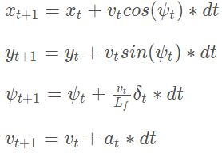
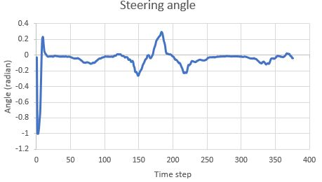
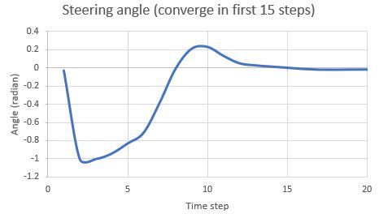

# CarND-Controls-MPC
Self-Driving Car Engineer Nanodegree Program

---
My code built without error with cmake .. && make, and connected to GUI with ./mpc. The vehicle successfully drove a lap around the track without leave the drivable portion of the track surface. The video recording is at 

## Model description
The control model used is **kinematic bicycle model**. 

The state variables are: position x,y, orientation psi, velocity v, cross track error cte and orientation error epsi. The actuators are steering angle delta and acceleration a. The model update equations are as below. Lf is the distance of vehicle mass center to its front axle.

 

The steering angle across the 1 lap run:

Steering angle converged smoothly in fist 15 time step (1.5s) with cost function compenents weights manually tuned. 

## Timestep Length and Elapsed Duration (N & dt)
Total time of model length of 1 second is chosen to balance the need of prediction reach and run-time efficiency of the model predictive control. N * dt = 1s. I've tried (N & dt) combination of (10,0.1), (20, 0.05) and (5,0.2). Only N=10, dt = 0.1s generates good predictive trajectory along the road direction. (20, 0.005) made the car sway vigorously at the beginning, and (5, 0.2) made the car deviate to the right curb after a few second, with other hyperparameters settings kept the same. 

## Polynomial Fitting and MPC Preprocessing
A 3-order polynomial is fitted to waypoints. The waypoints are shifted and transformed to vehicle's coordinates. It simplifies the process as positions px, py and orientation psi are all zeros after transformation.  

## Model Predictive Control with Latency
100 milliseconds latency is implemented in main.cpp file line 97-102. The time start of vehicle status are delayed by 0.1ms before waypoints polynomial fitting and MPC preprocessing.  
